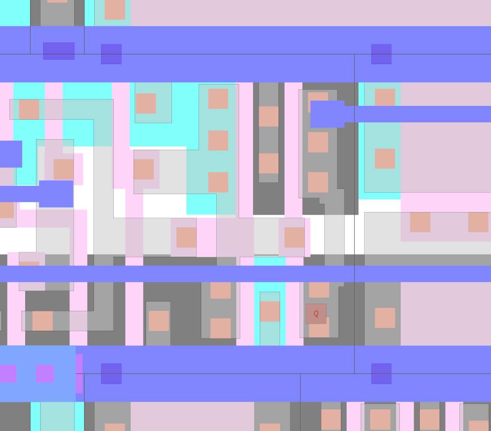

# Webinar slides

https://bit.ly/hardware-trojan-webinar 

# Trojan paper

https://iacr.org/archive/ches2013/80860203/80860203.pdf

My tweets about it: https://twitter.com/matthewvenn/status/1383421016630722565

# To test the RTL

Run

    make

In the top level directory. To view the trace:

    make show_top

# To build the GDS

copy the whole directory to openlane/designs

in top level openlane directory:

    make mount
    ./flow.tcl -design secure_co_padlock

# To extract the netlist

Load the GDS with magic, 
    
    cd gds
    magic top.gds

then type these commands in the tcl window:

    extract
    ext2spice lvs
    ext2spice

This will give you a spice file with no blackboxed cells.
Copy the extracted top.spice into the ./gds directory.

# To simulate the netlist

    cd gds
    ngspice simulation.spice

Takes less than 2 minutes.

Change one of the buttons by setting a different voltage and resimulate, now the lock stays shut.
Odd thing I noticed, if button 9 is set wrong, then the lock is open for a few ns before reset.
Button 8 does what I expect (lock starts high and stays high).

## spice notes

    display                 # show all vectors
    plot vector_name        # plot the vector. if you get a message about vector not existing, try putting in quotes

# Reverse engineer the circuit so we know what to hack

You can get a list of the standard cells here: https://antmicro-skywater-pdk-docs.readthedocs.io/en/test-submodules-in-rtd/contents/libraries/sky130_fd_sc_hdll/README.html

# Insert the trojan

open the spice file and find the references to sky130_fd_sc_hd__dfxtp_1
there are 2. We want to trojan only one, so copy the definition and rename it to sky130_fd_sc_hd__dfxtp_1_trojan
gt

In that subckt, we want to change the output's pfet to an nfet. Unfortunately we can't just change the def, because
only certain sizes of mosfets are 'recognised' in the PDK. This would not be a factor with a fabricated device.
So copy the nfet definition and adapt it to replace the pfet.

Then re-run the simulation and you should see the lock opening even though the combination is still wrong.

# Change the GDS

Now we have checked the trojan is going to break the lock as desired, we update the GDS so the masks are created
with the trojan in place. As we are only changing the N and P diffusion layer masks, this cannot currently be detected
with a microscope.

Start klayout in edit mode (-e) and find the flip-flop. Select the N diffusion layer nsdm.drawing, and using the box tool,
draw a box around the output pfet in the top right corner.

todo: re-read the paper and see if need to change both p and n fet.

# Limitations

* Spice takes ages to run even on small designs. An alternative that is supposed to have better performance is xyce, but I've not tried it.
* We need to do analogue sim as we want to verify the trojan works
* We are lucky because the gds has cell names that makes them easier to identify. If we extracted from an unknown PDK it might be harder to trace the cell names
* After synthesis, logic is optimised so it can be much harder to work out the intent of the design
* After altering the GDS it would be nice to re-extract the netlist and resimulate, but this doesn't work because magic doesn't recognise the trojan aas a flip flop anymore. 
* The extraction only works if we have the tech file of the PDK used for the chip. So this makes the hack harder to pull off.
* Masks are normally made by an external (to the foundry) factory. So we would like to change the GDS files there, but we also need access to the confidential PDK which only the customer and foundry have access to.
* Amro Tork: In my other life, we used to get the Mask files and check them using an automated tool to make sure they match our design.  For large cooperations to buy your chip, it was a must. You have to have this step in the flow.
